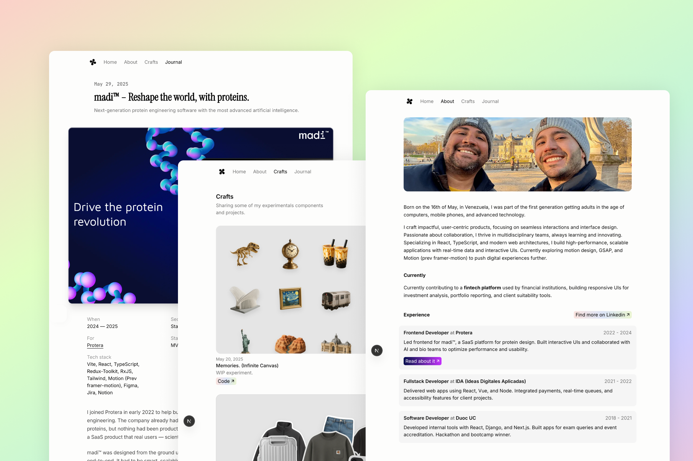

# 🎨 Julio Ramirez - Interactive Portfolio

<div style="text-align: center;">
  
</div>

## 🚀 Key Features

### 🎭 Interactive Experiments
- **3D Shader Effects** - Custom GLSL shaders with Three.js for image reveal animations
- **Motion Interactions** - Advanced animations using GSAP and Motion (Framer Motion)
- **Text Effects** - Parallax text, gradient scrolling, and streaming text animations
- **Map Interactions** - Interactive Mapbox integrations with smooth animations
- **Drag & Drop** - Curved draggable elements with physics-based interactions
- **Infinite Canvas** - Dynamic memory grid with infinite scrolling capabilities

### 📝 Content Management
- **MDX Blog System** - Rich content with embedded React components
- **Dynamic Routing** - File-based routing with `[slug]` patterns
- **Gray Matter** - Frontmatter parsing for blog metadata
- **Case Studies** - Detailed project documentation and analysis

### 🎨 Design & UX
- **Responsive Design** - Mobile-first approach with Tailwind CSS
- **Dark/Light Themes** - Seamless theme switching
- **Smooth Scrolling** - Lenis-powered smooth scroll experience
- **Custom Animations** - GSAP and Motion orchestrated animations
- **Interactive Elements** - Hover effects, transitions, and micro-interactions

### ⚡ Performance & Development
- **Next.js 15** - Latest App Router with RSC (React Server Components)
- **TypeScript** - Full type safety and developer experience
- **Turbopack** - Lightning-fast bundling for development
- **Code Splitting** - Dynamic imports and optimized loading
- **Image Optimization** - WebP format, lazy loading, and responsive images

## 🛠 Tech Stack

### Core Framework
- **Next.js 15** - React framework with App Router
- **React 19** - Latest React with concurrent features
- **TypeScript** - Type-safe development

### Styling & UI
- **Tailwind CSS 4** - Utility-first CSS framework
- **Radix UI** - Accessible component primitives
- **CSS Modules** - Component-scoped styling
- **Tailwind Animate** - Animation utilities

### Animation & 3D
- **GSAP 3** - Professional animation library
- **Motion** - React animation library (formerly Framer Motion)
- **Three.js** - 3D graphics and WebGL
- **React Three Fiber** - React renderer for Three.js
- **React Three Drei** - Useful helpers for R3F

### Content & Data
- **MDX** - Markdown with React components
- **Gray Matter** - YAML frontmatter parser
- **Next MDX Remote** - Server-side MDX processing

### Developer Experience
- **ESLint** - Code linting and quality
- **Prettier** - Code formatting
- **Husky** - Git hooks
- **Commitlint** - Conventional commit messages

### Additional Libraries
- **Lenis** - Smooth scrolling
- **Mapbox GL** - Interactive maps
- **Embla Carousel** - Touch-friendly carousels
- **Lucide React** - Beautiful icons
- **Use Sound** - Audio interactions

## 🚀 Quick Start

### Prerequisites
- **Node.js** 18+ 
- **pnpm** (recommended package manager)

### Installation

1. **Clone the repository**
   ```bash
   git clone https://github.com/juliorafre/portfolio.git
   cd portfolio
   ```

2. **Install dependencies**
   ```bash
   pnpm install
   ```

3. **Start development server**
   ```bash
   pnpm dev
   ```

4. **Open your browser**
   ```
   http://localhost:3000
   ```

### Available Scripts

```bash
# Development
pnpm dev          # Start development server
pnpm dev:turbo    # Start with Turbopack

# Production
pnpm build        # Build for production
pnpm start        # Start production server

# Code Quality
pnpm lint         # Run ESLint
```


## 🤝 Contributing

While this is a personal portfolio, contributions for bug fixes or improvements are welcome:

1. Fork the repository
2. Create a feature branch
3. Make your changes
4. Submit a pull request

## 📄 License

This project is open source and available under the [MIT License](LICENSE).

## 🎯 Performance

- **Lighthouse Score**: 95+ across all metrics
- **Core Web Vitals**: Excellent ratings
- **Bundle Size**: Optimized with dynamic imports
- **Loading Speed**: Sub-second initial page load

---

<div align="center">
  <p>Built with ❤️ by <a href="https://juliorafre.com">Julio Ramirez</a></p>
  <p>
    <a href="mailto:juliorafre@gmail.com">Email</a> •
    <a href="https://github.com/juliorafre">GitHub</a> •
    <a href="https://x.com/juliorafre">Twitter</a> •
    <a href="https://linkedin.com/in/juliorafre">LinkedIn</a>
  </p>
</div>